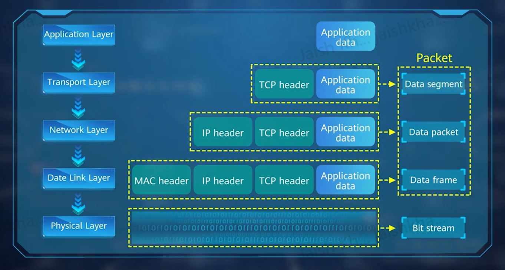

## OSI Model

It is a reference model created by the ISO (Internation Standards Organization).

1. L7: Application Layer --- Provides interface between network services and end users.
2. L6: Presentation Layer --- Providers functions like data presentation, encryption/decryption and compression/decompression.
3. L5: Session Layer --- Establishes, manages and terminates sessions.
4. L4: Transport Layer --- Defines protocol port number for data transmission and provides functions of flow controls and error detection.
5. L3: Network Layer --- Performs Logical Addressing and implements route selection between different networks.
6. L2: Data Link Layer --- Provides functions like establishing logical connections, hardware addressing and error correction.
7. L1: Physical Layer --- Establishes, Maintains and Disconnects physical connections.

## 5 Layer Internet Model

This is a reference model created since l6 and l5 were rarely used. So, **Application**, **Presentation** and **Session** layers are combined into one "Application" layer.

